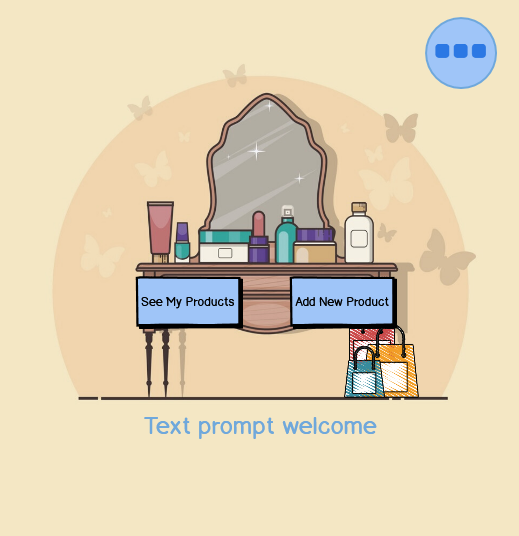

# DD_DB_MS3
'My Vanity', cosmetic manager (Milestone PJ 3 -CI FSC)

# My Vanity
Cosmetic Manager

**(MS Data Centric Development - Code Institute by Ángel González)**

This is a cosmatic manager, where you can add, filter and sort your cosmetics. The WebApp is both available to be played in browser of portable device. The app supports users login and access to a database to store the entries.

---

## **Table of Contents**

1. [UX](#UX)
    * [User Stories](#User-Stories)
    * [Strategy](#Strategy)
    * [Wireframes](#Wireframes)
    * [Scope](#Scope)
    * [Structure](#Structure)
    * [Theming](#Theming)
2. [Features](#Features)
    * [Future Features](#Future-Features-Objectives)

3. [Testing](#Testing)
4. [Deployment](#Deployment)

    * [Github Pages](#Configuration-of-GitHub-Pages)
    * [Cloning Repository](#Cloning-the-Repository)

5. [Credits](#Credits)

    * [Images](#Images)
    * [Music](#Music)
    * [Acknowledgements](#Acknowledgements)

6. [Contact](#Contact)

---
## UX
### User Stories
Users of this WebApp will be people wanting organize their amount of cosmetics and be able to access to it anywhere.

Examples could be (among many others):
* I'm on the shop and don't remember if I still own certain cosmetic or is over.
* I want to know the brand I use now because I mix it with the one I used before.
* I need to know when is my cosmetic going to perish because I need to buy replacement.

The site [(see full-size preview)](.\packageapp\static\images\screencaptures\full-view-browser.png) is based on a flask templates system. This system consists of a "Base" and then different "Views" filling inside of it depending on the route taken by the user. The way this system works makes all transitions easy and smooth for the user, being highly intuitive; and in this specific WebApp, is supported with flashed prompts each time an action is completed, giving this way direct info to the user of progress made.

In the browser version, the user finds the calls to action in the center of the window [(see full-size preview)](.\packageapp\static\images\screencaptures\full-view-browser.png) making it easier to focus on it and start engaging with the WebApp. In the portable device version, CTA's fill all the space [(see full-size preview)](.\packageapp\static\images\screencaptures\full-view-phone.png).

Users also find the navbar deployable floating button with the menu in every view, (see Features)](#Features), allowing easy an easy way for users to go to other views anytime they want.

### Strategy
The goal is that the user has a easy time inputting and/or editting their cosmetics and search and/or sort what they want in an intuitive way.

To achieve this, first, the design is clean and light and the theme used is composed of pastel colors [(see Theming)](#Theming). Secondly, and helped by the template system, the design is very stable and similar among all the views, getting to be familiar with the user in very few time.

The most ambitious goal, which wasn't part of the project itself due to requirements and time-frame, would be having a extrenal link to promoted products of certain kinds when the user's Vanity shows less than 5 products of said category, [(see Future Features)](#Future-Features-Objectives).

### Wireframes
Here are the first concept wireframes:

* [Index Page](\packageapp\static\wireframes\draft\Home.png "Index Page")

* [LogIn Prompt](\packageapp\static\wireframes\draft\LogIn.png "LogIn Prompt")

* Add and Edit forms: 

 
 

* [Search Cosmetics](/packageapp/static/wireframes/draft/Search_Result.png "Search Cosmetics")

Final concept wireframes:

* Index Page: 

    

* [LogIn Prompt](\packageapp\static\wireframes\idea\LogIn.png "LogIn Prompt")

* Add and Edit forms: 

    See [Features](#Features)

* [Search Cosmetics](\packageapp\static\wireframes\idea\Search_Result.png "Search Cosmetics")

